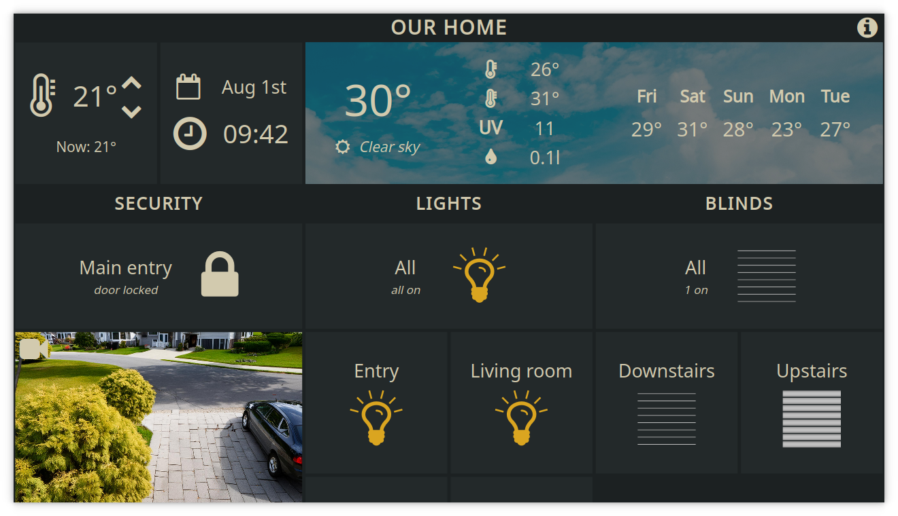
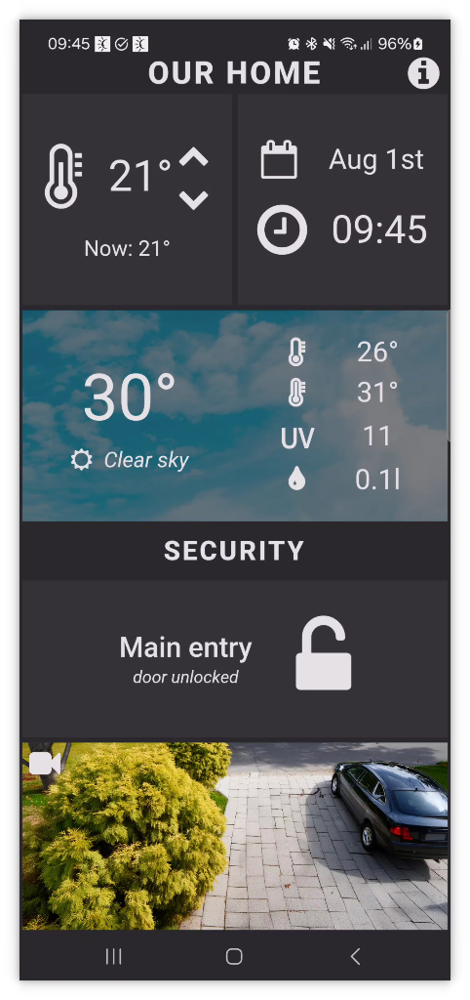

# Home Automation

Home Automation is a simple showcase application made by [Felgo](https://felgo.com/).

The application is an example of a home automation system written in Rust with the [Slint](https://slint.dev/) toolkit.

The main dashboard features several tiles. It is arranged differently in portrait and landscape orientations to optimize the user experience. The tiles can control household items (such as lockers, lights, and blinds) or display relevant information (like current weather and security camera previews). The application's user interface is responsive, adapting smoothly to different screen sizes.

### Check the application live [here](https://felgosdk.github.io/HomeAutomation/).

<p>
  
  
</p>

# Supported platforms

## Desktop
The application runs on all desktop platforms (Windows, Linux and macOS).

To start the application, execute:

```
cargo run
```

## Android
To be able to compile the application for Android, you must follow an initial setup. The instruction is available in [Slint's documentation](https://snapshots.slint.dev/master/docs/rust/slint/android/#building-and-deploying).

To start the application, execute:

```
cargo apk run --lib
```

## WebAssembly
It is also possible to embed the application in a web page. You need to install the `wasm-pack` crate for this.

```
cargo install wasm-pack
```

To build the application, execute:

```
wasm-pack build --target web --out-dir <output-dir>/pkg
```
   
To run locally:

```
cp <source-dir>/wasm/index.html <output-dir>/   # you can also provide your HTML file
cd <output-dir> & python3 -m http.server
```

Now, you can access the application at http://localhost:8000/.
